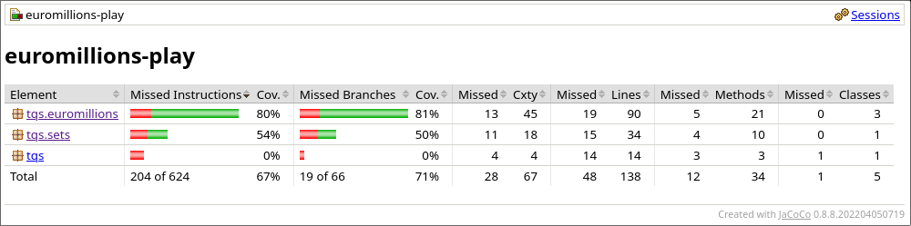
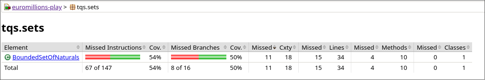
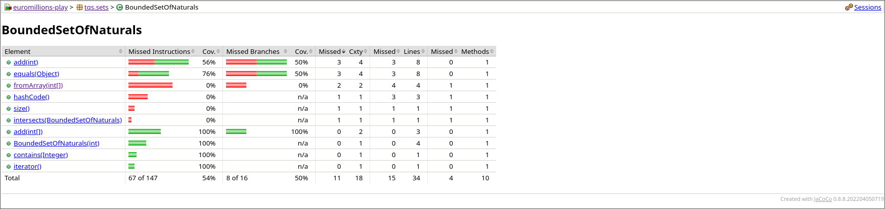
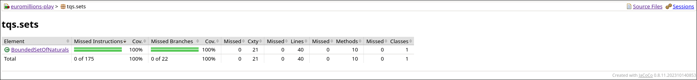
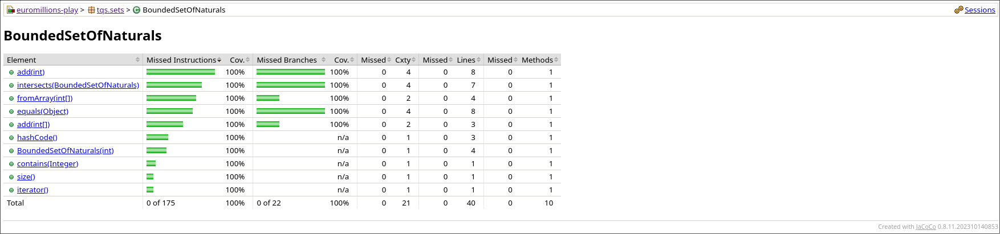

# Answers

## 2c/ Assess the coverage level in project “Euromillions-play”.

Analyze the results accordingly. Which classes/methods offer less coverage? Are all possible [decision] branches being covered?

The class with the lowest coverage is the CuponEuromillions class with 34%, though the methods that are not being tested are not critical to the implementation of the class' logic (format() and countDips()). Not all possible branches are being covered.

Tests that should be written for the BoundedSetOfNaturals class:

- Test the add function with Illegal add attempts i.e same number, out of range, other possibilities...
- Test the fromArray constructor method.
- Test the size method.
- Test the intersect method.
- Test the hashcode method.
- Test the equals method with various inputs.

### 2d/ Run Jacoco coverage analysis and compare with previous results. In particular, compare the “before” and “after” for the BoundedSetOfNaturals class.

#### Before

#### After

