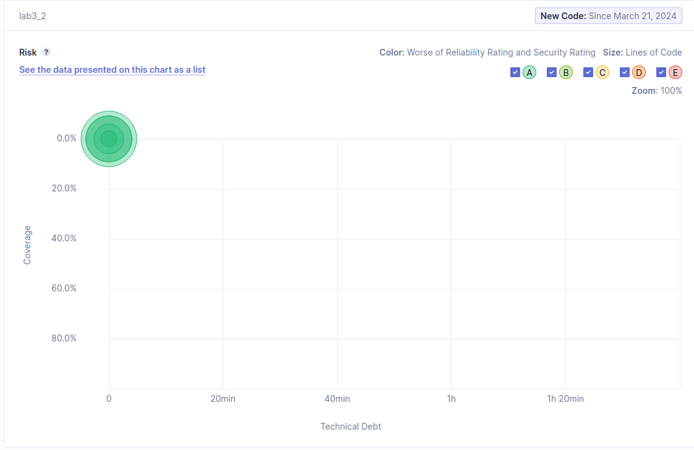

Technical debt: Technical debt is used as a metric that describes a metaphorical cost that is added when developers take shortcuts in the software development process. This cost corresponds to the time and effort that will be required in the future to fix/refactor the code.

# C) Run the static analysis and discuss the coverage values on the SonarQube dashboard (how many lines are “not covered”? And how many conditions? Are the values good?...)

Coverage values: 78.9%
Lines not covered: 57

Most of the lines not covered are simple setters and the default main method. All conditions of the code are covered. Overall, the values are good.